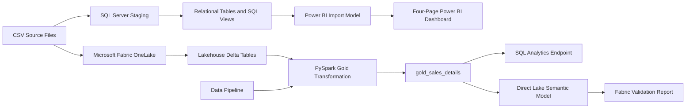

AutoParts End-to-End Analytics
End-to-end automotive parts sales analytics project built with SQL Server, Power BI, PySpark, and Microsoft Fabric.
> **Portfolio purpose:** demonstrate a complete analytics workflow from raw CSV files and relational modeling to cloud-based Lakehouse transformation, pipeline orchestration, Direct Lake semantic modeling, and business reporting.
---
Project Overview
This project analyzes synthetic automotive parts sales data across customers, products, regions, delivery performance, and monthly revenue targets.
The solution was developed in two connected tracks:
SQL Server + Power BI
Relational database design
Data staging and validation
SQL views and advanced analytical queries
Power Query transformation
Star-schema modeling
DAX measures
Four-page management dashboard
Microsoft Fabric
OneLake and Lakehouse ingestion
Delta Tables
SQL Analytics Endpoint
PySpark Gold transformation
Data quality validation
Data Pipeline orchestration
Direct Lake semantic model
Fabric validation report
---
Business Questions
How much revenue and gross profit were generated?
How does actual revenue compare with monthly targets?
Which products and categories contribute the most revenue?
Which customer segments and customers are most valuable?
What is the overall on-time delivery rate?
Which regions perform best or worst operationally?
Are KPI definitions consistent across SQL, PySpark, and Power BI?
---
Solution Architecture

---
Technology Stack
Area	Technology
Database	SQL Server 2025 Developer
SQL development	SQL Server Management Studio
Data transformation	Power Query, PySpark
BI and visualization	Power BI Desktop, Power BI Service
Cloud analytics	Microsoft Fabric
Storage	OneLake, Fabric Lakehouse, Delta Tables
Orchestration	Fabric Data Pipeline
Modeling	Star schema, Direct Lake semantic model
Analytics languages	T-SQL, DAX, Python / PySpark
---
Dataset
The dataset is synthetic and was created for portfolio and learning purposes.
Table	Rows	Purpose
`orders`	12,000	Transaction-level order data
`customers`	500	Customer attributes and segmentation
`products`	72	Product category, brand, cost, and price
`monthly_targets`	96	Monthly regional revenue targets
---
SQL Server Implementation
The relational database includes:
Primary and foreign keys
Staging table for CSV ingestion
Data type conversion and validation
Joins across orders, customers, and products
Reusable sales detail view
Monthly aggregation and target comparison
Window functions including `LAG`, `LEAD`, `ROW_NUMBER`, `RANK`, `DENSE_RANK`, and running totals
Core business logic:
```sql
Revenue = Quantity * UnitPrice * (1 - DiscountPct)
```
Only orders with `OrderStatus = 'Completed'` contribute to revenue, estimated cost, and gross profit.
---
Power BI Data Model
Main tables:
`Orders`
`Customers`
`Products`
`MonthlyTargets`
`DateTable`
`DimRegion`
`_Measures`
Main relationships:
`Customers[CustomerID]` → `Orders[CustomerID]`
`Products[ProductID]` → `Orders[ProductID]`
`DateTable[Date]` → `Orders[OrderDate]`
`DateTable[Date]` → `MonthlyTargets[MonthStartDate]`
`DimRegion[Region]` → `Orders[Region]`
`DimRegion[Region]` → `MonthlyTargets[Region]`
---
Core DAX Measures
```dax
Total Revenue =
CALCULATE(
    SUMX(
        Orders,
        Orders[Quantity]
            * Orders[UnitPrice]
            * (1 - Orders[DiscountPct])
    ),
    Orders[OrderStatus] = "Completed"
)
```
```dax
Gross Profit =
[Total Revenue] - [Total Estimated Cost]
```
```dax
Gross Margin % =
DIVIDE(
    [Gross Profit],
    [Total Revenue],
    0
)
```
```dax
Completed Orders =
CALCULATE(
    DISTINCTCOUNT(Orders[OrderID]),
    Orders[OrderStatus] = "Completed"
)
```
```dax
On-Time Delivery Rate =
DIVIDE(
    [On-Time Deliveries],
    [Completed Orders],
    0
)
```
---
Power BI Dashboard
1. Executive Overview
Management-level KPIs, monthly revenue vs target, and Year/Region filters.
2. Product Analysis
Revenue and gross profit by category, Top 10 products, and product-level profitability.
3. Customer Analysis
Revenue by customer segment, Top 10 customers, profitability, and average order value.
4. Operations Analysis
On-time delivery by region, average delivery days, monthly on-time trend, and late-delivery comparison.
---
Microsoft Fabric Implementation
Lakehouse and Delta Tables
Raw CSV files were uploaded to OneLake and loaded into:
`dbo.orders`
`dbo.customers`
`dbo.products`
`dbo.monthly_targets`
PySpark Gold Transformation
The Fabric Notebook created:
```text
dbo.gold_sales_details
```
The Gold table contains order, customer, product, revenue, cost, gross profit, and delivery-performance fields.
Data Quality Checks
Total rows = 12,000
Distinct Order IDs = 12,000
Missing customer matches = 0
Missing product matches = 0
Completed orders missing delivery days = 0
Pipeline Orchestration
The pipeline:
```text
PL_AutoParts_Gold_Refresh
```
runs:
```text
NB_AutoParts_Gold_Transformation
```
and rebuilds the Gold Delta Table.
Direct Lake Semantic Model
The model:
```text
SM_AutoParts_DirectLake
```
reads directly from `dbo.gold_sales_details`.
Core measures:
Total Revenue
Gross Profit
Gross Margin %
Completed Orders
On-Time Deliveries
On-Time Delivery Rate
---
KPI Reconciliation
Validated across SQL Server, Fabric SQL Analytics Endpoint, PySpark, Power BI, and Direct Lake:
KPI	Result
Total Orders	12,000
Completed Orders	10,527
Total Revenue	4.33M
Gross Profit	1.71M
Gross Margin	39.5%
On-Time Delivery Rate	72.6%
---
Key Findings
Revenue achievement was approximately 30% of the synthetic target level.
Gross margin remained close to 40%.
Retail customers generated the largest share of revenue.
Interior and Electronics were the leading product categories by revenue.
Regional on-time delivery performance ranged roughly from 71% to 74%.
Operational performance was more stable in 2025 than in 2024.
---
Repository Structure
```text
autoparts-end-to-end-analytics/
├── README.md
├── assets/
│   ├── architecture/
│   ├── powerbi-dashboard/
│   └── fabric/
├── data/
├── sql/
├── fabric/
│   ├── notebooks/
│   ├── pipeline/
│   └── semantic-model/
├── dax/
└── documentation/
```
---
AI-Assisted Development Disclosure
AI tools were used as a learning and productivity assistant for:
Explaining SQL, DAX, PySpark, and Fabric concepts
Drafting and reviewing code structure
Troubleshooting implementation errors
Organizing documentation and portfolio content
Suggesting dashboard formatting and presentation improvements
All implementation steps were executed by the project author. Outputs were reviewed and validated through row-count checks, SQL reconciliation, data-quality tests, and comparison of KPI results across SQL Server, PySpark, Power BI, and Microsoft Fabric.
---
Skills Demonstrated
Relational database design
SQL ingestion and transformation
Advanced analytical SQL
Power Query and DAX
Dashboard design
Data quality validation
PySpark DataFrame transformation
Lakehouse and Delta Table architecture
Pipeline orchestration
Direct Lake modeling
KPI reconciliation
Technical documentation
---
Project Status
SQL Server implementation: Completed
Power BI dashboard: Completed
Microsoft Fabric implementation: Completed
Documentation: Completed
Portfolio packaging: In progress
